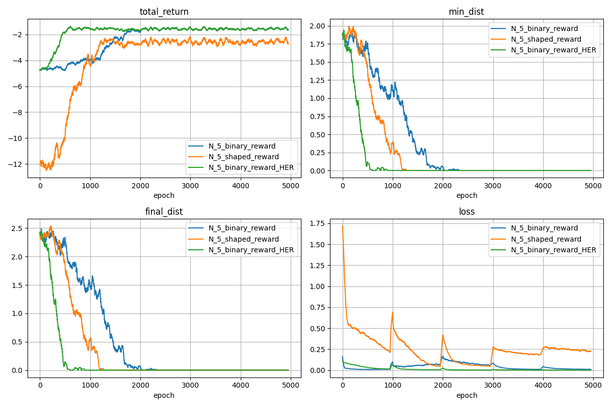
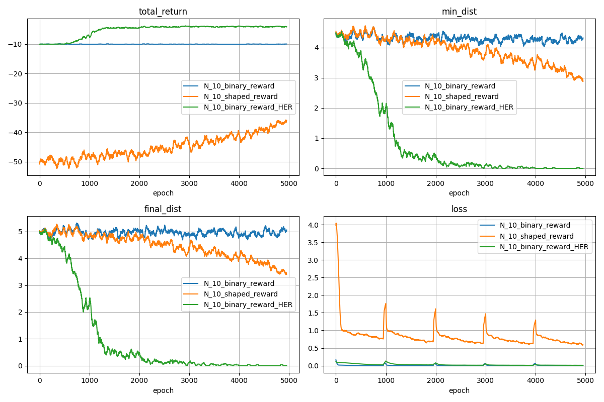
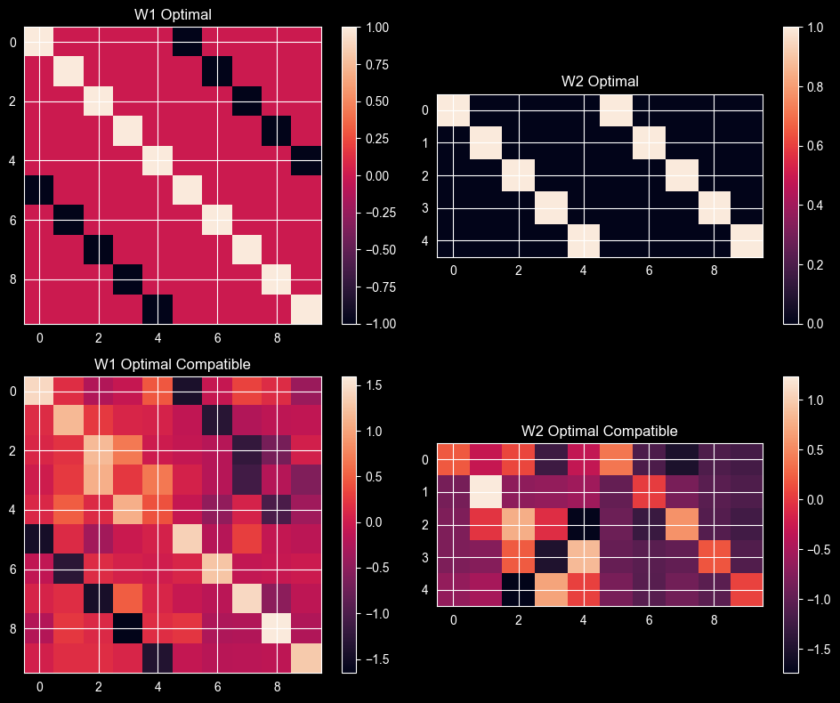

# HER BFP DQN Experimentation Framework

This project implements [Hindsight Experience Replay (HER)](https://arxiv.org/pdf/1707.01495), demonstrated on the Bit-Flipping Problem (BFP) with Deep Q-Learning (DQN).

## Table of Contents
- [Results](#results)
- [Setup](#setup)
- [Usage](#usage)
  - [Running Experiments](#running-experiments)
  - [Training a Single Model](#training-a-single-model)
  - [Comparing Runs](#comparing-runs)
- [Project Structure](#project-structure)

## Results
### N=5, with 2-layer DQN and hidden dimension of 128


### N=10, with 2-layer DQN and hidden dimension of 128


## Reconstructing optimal policy
See [this notebook](scripts/evaluate_optimal_compatible_policy.ipynb) for an experiment attempting to reconstruct the optimal policy.


## Setup

Ensure you have the required dependencies:
```bash
pip install torch numpy tqdm matplotlib
```

## Usage

### Running Experiments
The `run_experiment.py` script executes a batch of runs defined in a JSON config file located in the `experiments/` directory.

```bash
python scripts/run_experiment.py --experiment-name experiment_name
```

**Arguments:**
- `--experiment-name`: Name of the experiment JSON file in the `experiments/` folder (without `.json`). Defaults to `mini_experiment`.

### Training a Single Model
You can run individual training sessions using `bfp_dqn.py`.

```bash
python src/bfp_dqn.py --N 5 --p-her 0.8 --n-epochs 1000 --run-name name
```

**Key Arguments:**
- `--N`: Environment size (number of bits).
- `--p-her`: Probability of using HER samples.
- `--n-epochs`: Number of training epochs.
- `--run-name`: Run name which will be used to save the results.
- Run `python src/bfp_dqn.py --help` for a full list of parameters.

### Comparing Runs
If you have multiple runs files in JSON format, you can compare them manually using `_plot_experiment.py`:

```bash
python scripts/_plot_experiment.py --run-names run_name1 run_name2 --experiment-name experiment_name
```

## Project Structure

```text
her/
├── README.md                # Project description and setup instructions
├── src/
│   ├── her.py               # Hindsight Experience Replay implementation
│   ├── train_dqn.py         # DQN training logic
│   ├── bfp_env.py           # Bit-Flipping Problem environment logic
│   └── bfp_dqn.py           # DQN model architecture and training
├── scripts/
│   ├── run_experiment.py    # Orchestrates multiple training runs
│   └── _plot_experiment.py  # Utility for comparing and plotting results
├── experiments/
│   └── *.json               # Experiment configuration files (e.g., mini_experiment.json)
└── outputs/                 # Storage for results (.json), plots (.png) and models (.pt)
```
